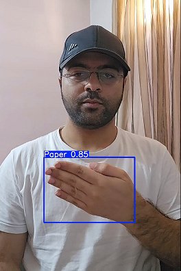
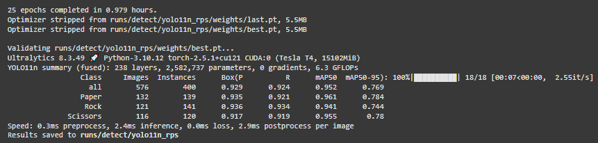
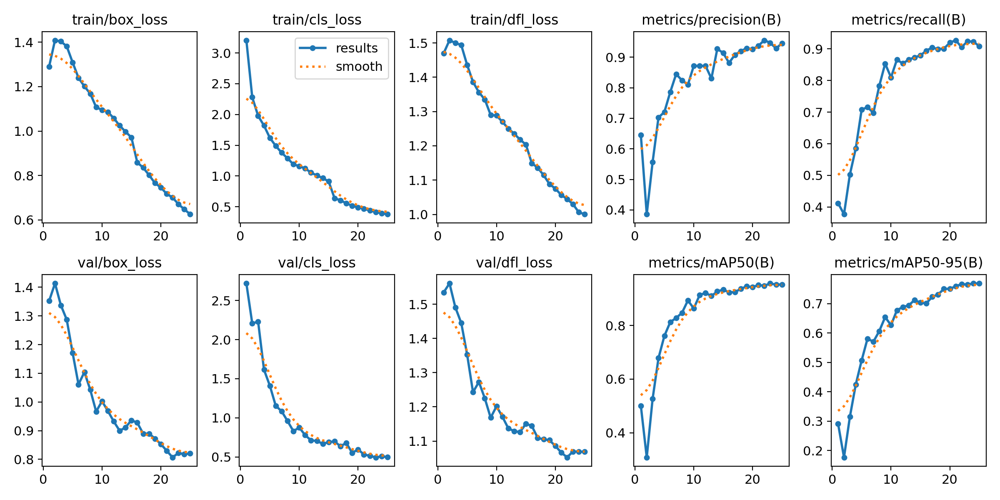
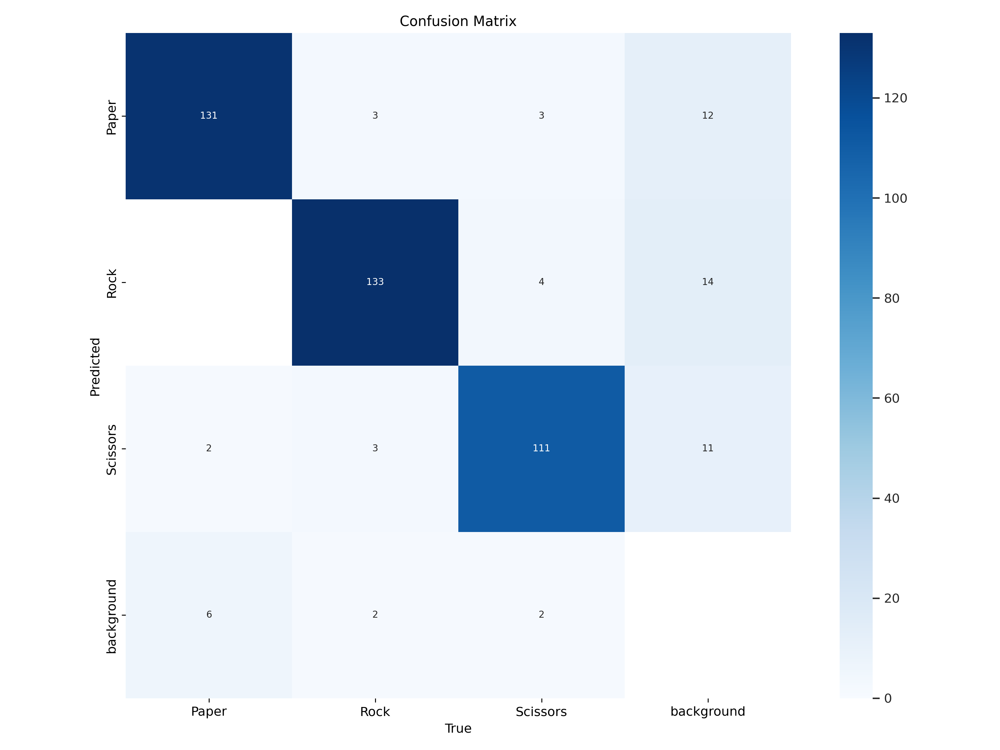
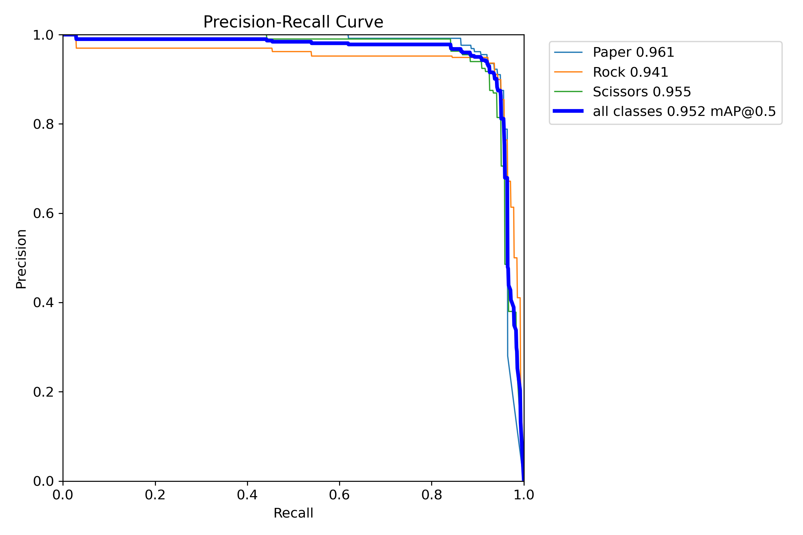

# Rock Paper Scissors Detection using YOLO11

This is my attempt at fine-tuning YOLO11 for the **Rock-Paper-Scissors** detection task.

[](YTTTTT)

To see the model's performance on a video: [YTTTTT](YTTTTT)

## Training

The training code is available in the [Rock_Paper_Scissor_detection_YOLO11.ipynb](Rock_Paper_Scissor_detection_YOLO11.ipynb) notebook.
Training took around 1 hour (25 epochs) on a *Tesla T4* GPU and here are the results:
```
mAp50: 0.952
mAP50-95: 0.9769
```


## Usage

You can download and use the fine-tuned model using the following code:

```python
from ultralytics import YOLO

# Load the model
model = YOLO('yolo11-rps-detection.pt')

# Load the image
img = "image_or_video_path"

# Run inference
results = model(img)
results[0].show() 
```

download `yolo11-rps-detection.pt` from [weights/yolo11-rps-detection.pt](weights/yolo11-rps-detection.pt)

## Dataset

The dataset used for this project is [Rock Paper Scissors](https://universe.roboflow.com/roboflow-58fyf/rock-paper-scissors-sxsw) from roboflow universe.

## Results

### Plots of various metrics



### Confusion Matrix



### Precision-Recall Curve



## Credits

Based on the `yolo11n` model from ultralytics.

Fine-tuned for this task by Gholamreza Dar, December 2024.

